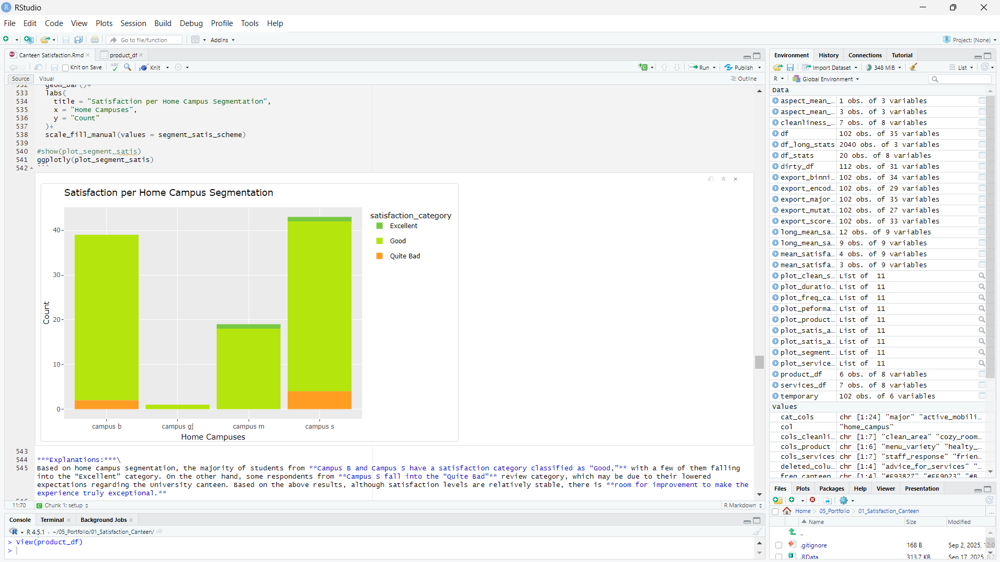

# Canteen Satisfaction Analysis

<table>
  <tr>
    <td align="center" width="100%">
      <!-- Ganti link gambar di bawah ini dengan plot hero kamu -->
      
    </td>
  </tr>
</table>


Canteen Satisfaction Analysis is a data-driven project that explores students' perceptions of the university canteen.  
Using R and statistical analysis, this project identifies key satisfaction indicators, visualizes trends, and provides actionable recommendations to enhance service quality, menu variety, pricing, and overall experience.

<br>

## Developer
Defa Danuarta (Data Analyst & Computer Science Student)  
<br>

## Built Time
This project was developed over several days as part of a data analysis learning initiative.  
<br>

---

## Libraries Used

This project was built using the following R libraries:

```r
library(ggplot2)     # Data visualization
library(plotly)      # Interactive plots
library(dplyr)       # Data manipulation
library(tidyr)       # Data tidying
library(readxl)      # Reading Excel files
library(knitr)       # R Markdown rendering
library(DT)          # Interactive tables
library(lubridate)   # Working with timestamps
```

## Guide to run the code
---

### _Run via RStudio Evironment:_
1. Open RStudio
2. Load the environment if needed (.RData will auto-load)
3. Install required libraries (only once):
```r
install.packages(c("ggplot2", "plotly", "dplyr", "tidyr", "readxl", "knitr", "DT", "lubridate"))
```
4. Open file "Canteen Satisfaction.Rmd"
5. Click Knit -> to generate the HTML report.

### _Run Directly in .rmd Without Setup_
1. Open the file Canteen Satisfaction.Rmd
2. Run it directly using:
```r
rmarkdown::render("Canteen Satisfaction.Rmd")
```
3. R will automatically:
   - load the script
   - install missing packages (if configured)
   - generate the output Canteen-Satisfaction.html

---

## Features & Scripts 

<table>
  <tr>
    <th>Main File / Script</th>
    <th>Description</th>
  </tr>

  <tr>
    <td><b><code>Canteen Satisfaction.Rmd</code></b></td>
    <td>Main analysis file containing the full workflow: data cleaning, transformation, visualization, and recommendations in a single R Markdown document.</td>
  </tr>

  <tr>
    <td><code>1st_cleaned_mutated_questionnaire_results.csv</code></td>
    <td>Cleaned version of the original dataset with mutated fields applied.</td>
  </tr>

  <tr>
    <td><code>2nd_encoded_questionnaire_results.csv</code></td>
    <td>Dataset with encoded Likert-scale responses for standardized analysis.</td>
  </tr>

  <tr>
    <td><code>3rd_avg_scores_added_questionnaire_results.csv</code></td>
    <td>Includes computed average satisfaction scores for each participant.</td>
  </tr>

  <tr>
    <td><code>4th_binning_scores_added_questionnaire_results.csv</code></td>
    <td>Contains binned satisfaction categories (e.g., low/medium/high).</td>
  </tr>

  <tr>
    <td><code>5th_grouped_major_added_questionnaire_results.csv</code></td>
    <td>Aggregated dataset grouped by student major for demographic comparison.</td>
  </tr>

  <tr>
    <td><code>Canteen-Satisfaction.html</code></td>
    <td>Exported HTML report generated from the R Markdown analysis.</td>
  </tr>

</table>


---

## Files description
```
├── .RData                                                     # Environment data saved by R
├── .Rhistory                                                  # Command history from RStudio
├── .gitignore                                                 # Ignore temporary RStudio files
│
├── questionaire_result.xlsx                                   # Original questionnaire result (raw data)
│
├── 1st_cleaned_mutated_questionnaire_results.csv              # Cleaned + mutated version
├── 2nd_encoded_questionnaire_results.csv                      # Encoded Likert categories
├── 3rd_avg_scores_added_questionnaire_results.csv             # Added average satisfaction scores
├── 4th_binning_scores_added_questionnaire_results.csv         # Binned satisfaction categories
├── 5th_grouped_major_added_questionnaire_results.csv          # Grouping by major and additional features
│
├── Canteen Satisfaction.Rmd                                   # Main analysis file (R Markdown)
├── Canteen-Satisfaction.html                                  # Exported HTML report
│
├── LICENSE                                                    # Project license
└── README.md                                                  # Documentation
```
